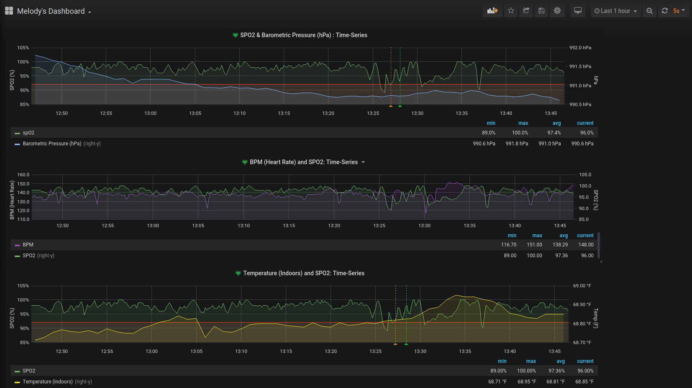

# Masimo Rad-8 Pulse Oximeter Data to InfluxDB

A simple **Python3** script to read serial data from a **Masimo Rad-8 Pulse Oximeter**. Samples are taken
at a frequency of 1 sample/second, put in JSON format and sent to a local **InfluxDB** instance. This
data is visualized using **Grafana**.

## Purpose

My daughter has a trach and is ventilator dependent. My wife and I need to watch her O2 percentages
and were only able to do so if we were sitting in front of the pulse oximeter. Now, using influxDB 
and Grafana running on a local server, we can see her specific oxygen and heartrate from anywhere in
our home.

### Long-term Goal

My daughter has intermittent desats which I do not fully understand. My hypothesis is that since
she also has a **VP Shunt** that it is related to the barometric pressure. This is why I am also
monitoring the barometric pressure, indoor temperature & humidity using Bosch's **BME280**. After
approximately 30-days, I will be exporting the pulse-oximeter and weather data to look for correlation
between her breathing and other external factors.

## Grafana Dashboard for Pulse Oximeter Data w/ Inside Weather

## How to Use

These scripts are installed on a Raspberry Pi Zero W running Debian Buster Lite. The Pi is strapped
to my daughters pulse oximeter which is sometimes mobile. Due to the pulse oximeter and Pi being
mobile, I energize the Pi using a cell phone battery charger. Because the charge is not infinite and I
do not want to hook the pi up to a monitor or ssh in every power cycle, I use a keep_going script. The
keep_going script has been setup to run every minute as a cronjob. If the keep_going script sees
pox_2_influx running in the background, nothing is done and keep_going will exit. If pox_2_influx is not
running, then it will be executed. Please change the path w/in graf_keep_going.sh to reflect the location
of pox_2_influx.py.

The bme_influx.py file as mentioned above is to capture the weather parameters from a Bosch BME280 sensor
also running on the Raspberry Pi Zero W. The sensor is connected to the i2c bus on port 1 and address 0x77.
This script does not need or require the keep_going script but is currently setup to run every minute via
a cronjob.

The two primary files are:

1. pox_2_influx.py
2. graf_keep_going.sh

Additional weather tracker using BME280:

1. bme_influx.py
